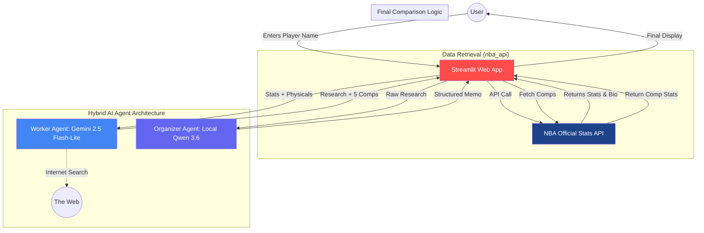

# 🏀 NBA Advanced Scout & Comp Engine

A high-performance NBA scouting application that combines live data from `nba_api` with a multi-model AI agent architecture. It uses **Gemini 2.5 Flash-Lite** (cloud) for real-time internet research and **Qwen 3.6** (local via Ollama) to synthesize professional scouting reports.

## 🚀 Features
- **Live Stats:** Pulls career, physical, and advanced stats directly from NBA servers.
- **Hybrid AI Architecture:**
  - **Worker Agent:** Uses Gemini-2.5-Flash-Lite for internet-connected research and player comparison discovery.
  - **Organizer Agent:** Uses a local Qwen 3.6 (35b-a3b) model to compile data into an executive memo.
- **Deep Comparisons:** Automatically fetches and displays the stats for the 5 most comparable players identified by the AI.

## 🛠️ Prerequisites
- **Python 3.14**
- **Ollama:** Installed and running locally.
- **Gemini API Key:** Obtained from [Google AI Studio](https://google.com).

## 📦 Setup & Installation

1. **Clone the repository** (or navigate to your project folder).
2. **Install dependencies:**
   ```bash
   pip install -r requirements.txt
   ```
3. **Configure Environment Variables:**
   Create a `.env` file in the root directory and add your key:
   ```text
   GOOGLE_API_KEY=your_google_api_key_here
   ```
4. **Prepare Local Model:**
   Ensure Ollama is running and pull the Qwen model:
   ```bash
   ollama pull qwen3.6
   ```

## 🖥️ Usage
Run the application using Streamlit:
```bash
streamlit run app.py
```

1. **Step 1:** Enter a player's name and click **"Pull Player Stats"**.
2. **Step 2:** Review the career and advanced data.
3. **Step 3:** Click **"Analyze Player Find Comps"** to trigger the AI agents.
4. **Step 4:** Review the comparison player charts and the generated scouting memo.

## 🏗️ Architecture
- **Data Source:** `nba_api` (Python)
- **Frontend:** Streamlit
- **Worker (Researcher):** Google Gemini 2.5 Flash-Lite
- **Organizer (Editor):** Ollama qwen3.6:35b-a3b

