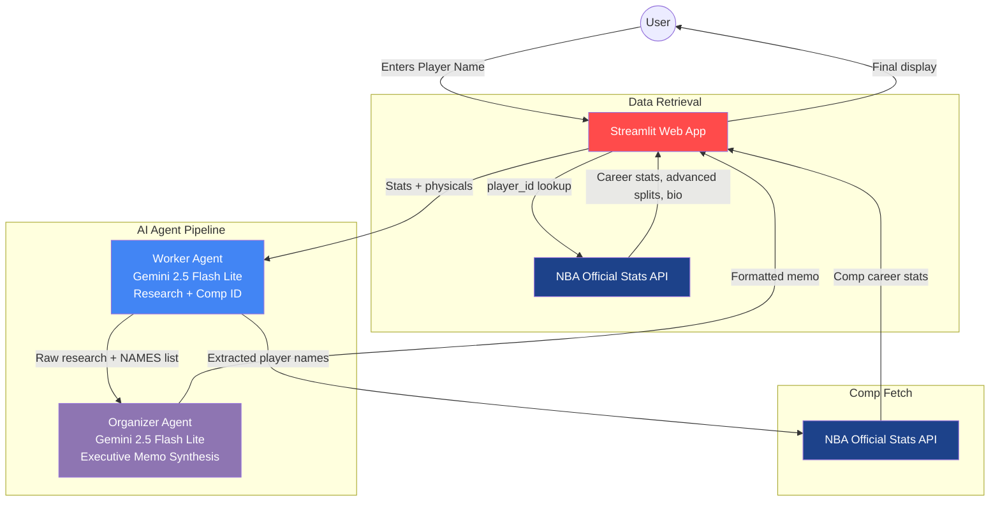

# 🏀 NBA Advanced Scout & Comp Engine


A professional NBA scouting application that combines live player data from the official NBA Stats API with a two-stage AI agent architecture. The system researches player tendencies, identifies comparable players, fetches their live stats, and synthesizes everything into an executive scouting memo.

---

## 🚀 Features

- **Live NBA data** — pulls career stats, advanced splits, and physical profile directly from NBA servers via `nba_api`
- **Worker / Organizer agent pattern** — two sequential Gemini calls with distinct roles: one for research and comp identification, one for structured memo synthesis
- **Deep comp analysis** — automatically fetches and displays career stats for the 5 most comparable players identified by the AI
- **Password-protected UI** — secure access via Streamlit secrets
- **Cloud-only architecture** — runs entirely on Gemini 2.5 Flash Lite, no local model required

---

## 🏗️ Architecture


```mermaid
graph TD
    User((User)) -->|Enters Player Name| Streamlit[Streamlit Web App]

    subgraph "Data Retrieval"
        Streamlit -->|player_id lookup| NBA[NBA Official Stats API]
        NBA -->|Career stats, advanced splits, bio| Streamlit
    end

    subgraph "AI Agent Pipeline"
        Streamlit -->|Stats + physicals| Worker[Worker Agent\nGemini 2.5 Flash Lite\nResearch + Comp ID]
        Worker -->|Raw research + NAMES list| Organizer[Organizer Agent\nGemini 2.5 Flash Lite\nExecutive Memo Synthesis]
        Organizer -->|Formatted memo| Streamlit
    end

    subgraph "Comp Fetch"
        Worker -->|Extracted player names| NBA2[NBA Official Stats API]
        NBA2 -->|Comp career stats| Streamlit
    end

    Streamlit -->|Final display| User

    style Worker fill:#4285F4,color:#fff
    style Organizer fill:#8E75B2,color:#fff
    style NBA fill:#1d428a,color:#fff
    style NBA2 fill:#1d428a,color:#fff
    style Streamlit fill:#ff4b4b,color:#fff
```

### How the two agents differ

| | Worker Agent | Organizer Agent |
|---|---|---|
| **Role** | Research player tendencies, identify 5 comps | Format raw research into executive memo |
| **Input** | Career stats, physical profile | Raw research text from Worker |
| **Output** | Analysis + `NAMES:` comp list | Structured memo: Overview, Strengths, Weaknesses, Comps |
| **System prompt** | None — open research task | Defined scout persona with formatting instructions |

---

## 🛠️ Skills Demonstrated

**Hybrid multi-agent architecture** — Worker/Organizer pattern with two sequential LLM calls, each scoped to a distinct task. The Worker is optimized for research and extraction; the Organizer is given a persona and formatting constraints via system prompt.

**Domain-specific API integration** — pulls from three separate `nba_api` endpoints (`PlayerCareerStats`, `CommonPlayerInfo`, `PlayerDashboardByGeneralSplits`) and merges them into a unified player object. DataFrame slicing (`tail(5).to_string()`) summarizes recent performance for LLM context without overwhelming the prompt.

**Structured output extraction** — the `NAMES:` convention prompts the Worker to emit a machine-readable line at the end of natural language output, parsed with regex to drive the comp fetch pipeline.

**Lazy initialization** — LLM clients are instantiated at call time rather than module load, avoiding connection overhead and credential errors on app startup.

**Secrets management** — `get_secret()` helper tries local `.env` first then falls back to `st.secrets`, enabling the same codebase to run locally and on Streamlit Cloud without modification.

---

## 📦 Setup & Installation

### Prerequisites
- Python 3.12+
- Google API key from [Google AI Studio](https://aistudio.google.com/apikey)

### 1. Clone and install

```bash
git clone https://github.com/yourusername/nba-scout-engine.git
cd nba-scout-engine
pip install -r requirements.txt
```

### 2. Configure environment

Create a `.env` file in the project root:

```env
GOOGLE_API_KEY=your_google_api_key_here
APP_PASSWORD=your_app_password_here
```

### 3. Run

```bash
streamlit run app.py
```

---

## 🖥️ Usage

1. Enter a player's full name (e.g. `LeBron James`) and click **Pull Player Stats**
2. Review career stats and advanced splits
3. Click **Analyze Player & Find Comps** to trigger the agent pipeline
4. Review the comparison player stats and the generated executive scouting memo

---

## 📁 Project Structure

```
nba-scout-engine/
├── app.py              # Streamlit app — all agent logic and UI
├── requirements.txt
├── .env                # Local secrets (never committed)
├── .gitignore
└── README.md
```

---

## 🔧 Tech Stack

| Layer | Technology |
|---|---|
| Frontend | Streamlit |
| AI — Worker & Organizer | Google Gemini 2.5 Flash Lite |
| NBA Data | nba_api |
| Data manipulation | Pandas |
| Environment | python-dotenv |

---

## ⚠️ Disclaimer

This tool is for research and entertainment purposes only. Scouting analysis is AI-generated and should not be used as the basis for professional roster decisions.
